# Review sheet — what the planted defects actually changed

**For Kevin. 2026-09-16. Blind.** Each item is a pair, **A** and **B**, in random order: one is the site as it is, the other has a small defect planted in the code. You are not told which. One visual pair is a control with **no** difference at all, and one is a control with a deliberate one.

**Visual items** are cropped to the region where the two screenshots differ (with a margin), taken in real Chrome from the built site. Answer two things: *do they differ?* (`y` / `n` / `?`) and, if so, *is one of them wrong — `A`, `B`, `neither` (just different), or `?`*.

**Number items** are values from `measures.json` / `teams.json` — the documents the site publishes — computed over 52 real games. Answer: *is one of them plainly wrong — `A`, `B`, `neither`, or `?`*. "I can't tell without context" is a useful answer.

---

## Visual

### V1. 1400×900 · ?at=1-12%3A25

| A | B |
|---|---|
| 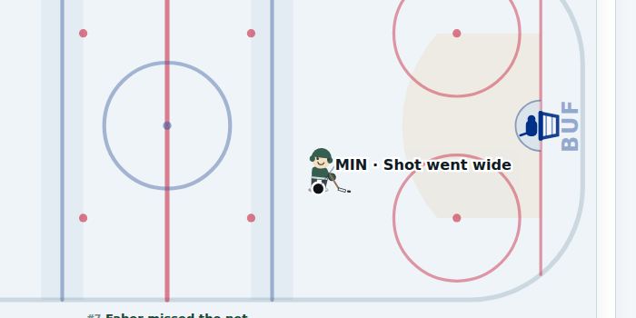 |  |

Differ? → y
If they differ — is one of them wrong, and which? → A

### V2. 1400×900 · (opening frame)

| A | B |
|---|---|
| 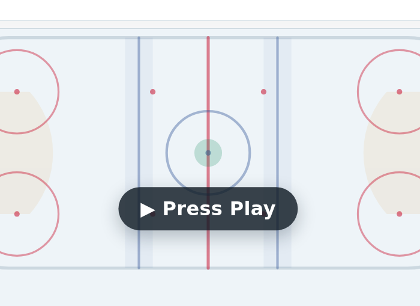 | 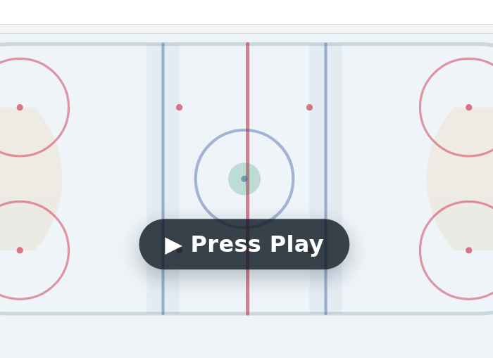 |

Differ? → n
If they differ — is one of them wrong, and which? → neither

### V3. 1400×900 · ?at=1-12%3A25

| A | B |
|---|---|
|  | 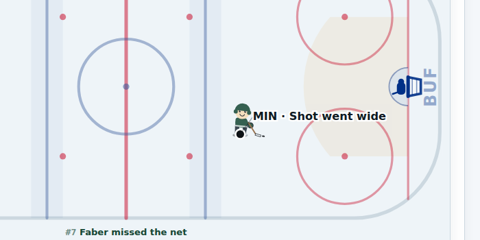 |

Differ? → n
If they differ — is one of them wrong, and which? → neither

### V4. 1400×900 · (opening frame)

| A | B |
|---|---|
|  | 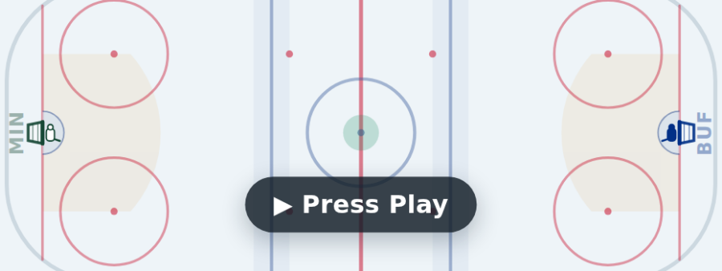 |

Differ? → n
If they differ — is one of them wrong, and which? → neither

### V5. 1400×900 · ?at=1-12%3A25

| A | B |
|---|---|
| 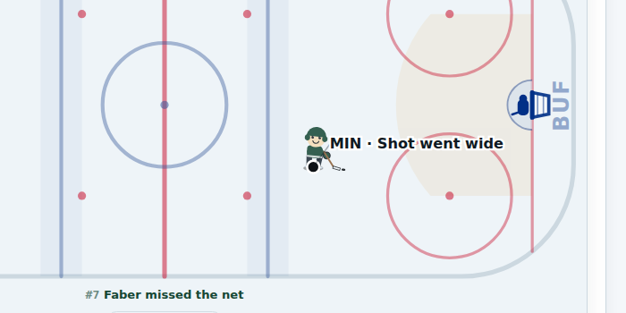 |  |

Differ? → y
If they differ — is one of them wrong, and which? → B

### V6. 1400×900 · ?at=1-12%3A25

| A | B |
|---|---|
| 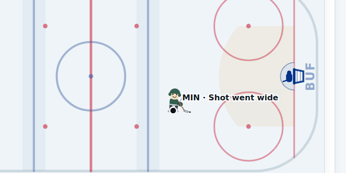 |  |

Differ? → y
If they differ — is one of them wrong, and which? → B

### V7. 1400×900 · ?layer=whistle&at=1-03%3A10

| A | B |
|---|---|
|  | 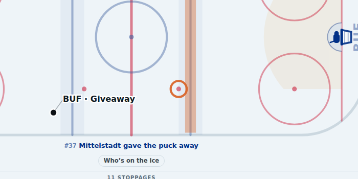 |

Differ? → y
If they differ — is one of them wrong, and which? → B

### V8. 1400×900 · ?at=1-12%3A25

| A | B |
|---|---|
|  | 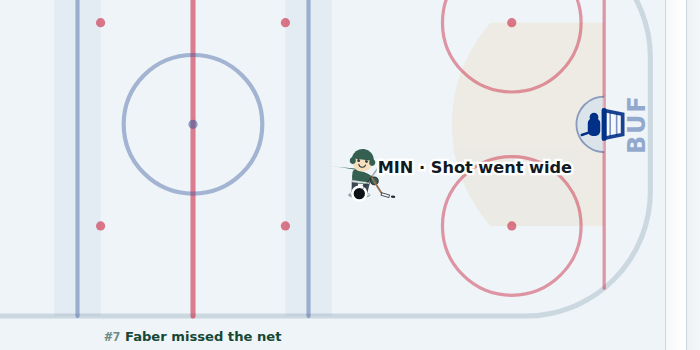 |

Differ? → n
If they differ — is one of them wrong, and which? → neither

### V9. 1400×900 · ?at=1-12%3A25

| A | B |
|---|---|
|  | 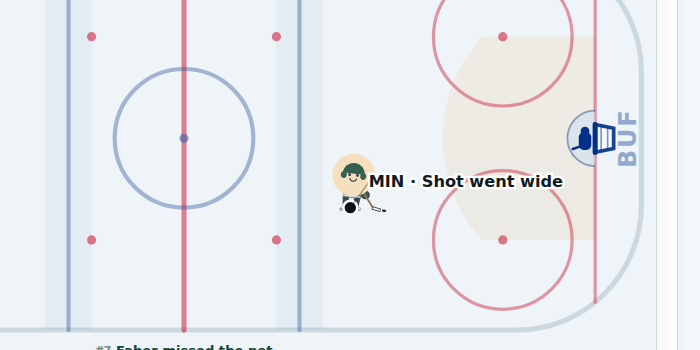 |

Differ? → y
If they differ — is one of them wrong, and which? → B

### V10. 1400×900 · (opening frame)

| A | B |
|---|---|
|  |  |

Differ? → y
If they differ — is one of them wrong, and which? → A

### V11. 1400×900 · ?layer=corsi&at=1-03%3A10

| A | B |
|---|---|
| 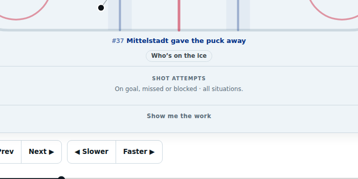 | 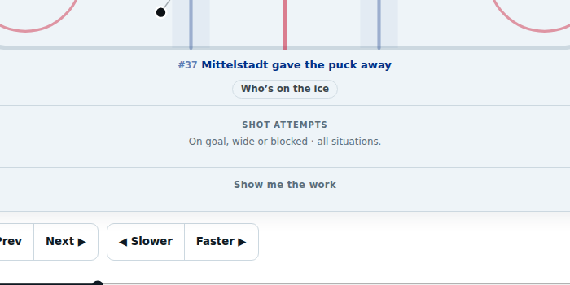 |

Differ? → n
If they differ — is one of them wrong, and which? → neither

### V12. 1400×900 · penalties

| A | B |
|---|---|
| 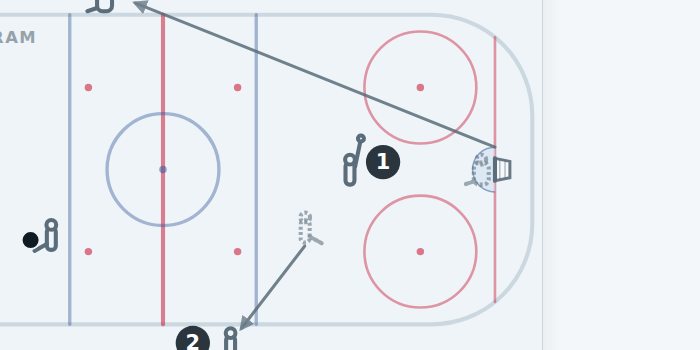 | 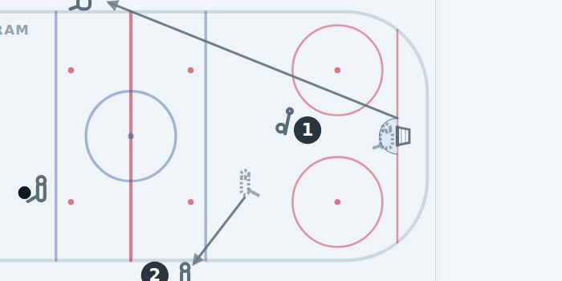 |

Differ? → y
If they differ — is one of them wrong, and which? → B

### V13. 1400×900 · ?at=1-12%3A25

| A | B |
|---|---|
| 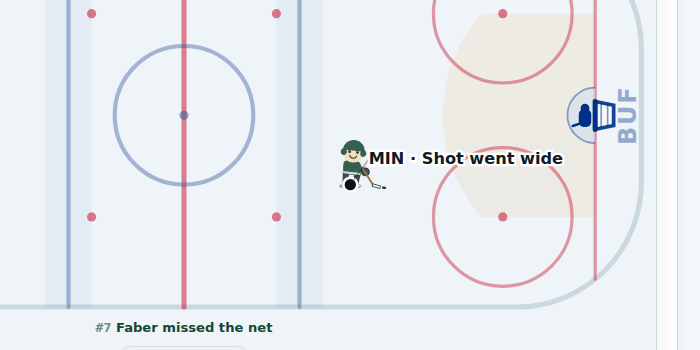 |  |

Differ? → n
If they differ — is one of them wrong, and which? → neither

### V14. 1400×900 · ?at=2-06%3A31.2

| A | B |
|---|---|
| 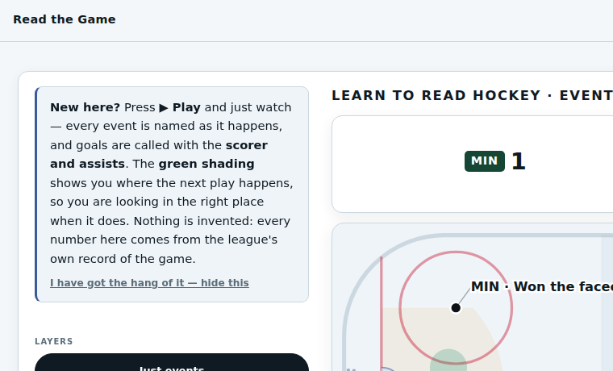 |  |

Differ? → n
If they differ — is one of them wrong, and which? → neither

---

## Published numbers

### N1. 1 published value(s) differ

| published figure | A | B |
|---|---|---|
| `measures.json → census.hits.r` | 0.183 | 0.209 |

Is one of these plainly wrong, and which? → neither

### N2. 2 published value(s) differ

| published figure | A | B |
|---|---|---|
| `teams.json → archive.slotShare.n` | 4641 | -4641 |
| `teams.json → archive.slotShare.rate` | 0.4751131221719457 | -0.4751131221719457 |

Is one of these plainly wrong, and which? → B

### N3. 1404 published value(s) differ — the first 8 shown

| published figure | A | B |
|---|---|---|
| `measures.json → goalieNight.faced.counts.46` | 0 | undefined |
| `measures.json → goalieNight.faced.counts.47` | 0 | undefined |
| `measures.json → goalieNight.faced.counts.48` | 0 | undefined |
| `measures.json → goalieNight.faced.counts.49` | 0 | undefined |
| `measures.json → goalieNight.faced.counts.50` | 0 | undefined |
| `measures.json → goalieNight.faced.counts.51` | 0 | undefined |
| `measures.json → perGame.2023.blocked.counts.50` | 0 | undefined |
| `measures.json → perGame.2023.blocked.counts.51` | 0 | undefined |

Is one of these plainly wrong, and which? → B

### N4. 2 published value(s) differ

| published figure | A | B |
|---|---|---|
| `measures.json → attemptMix.saveFraction.what` | "of the shots a goalie actually faced, this many were saved — an empty-net goal is not among them, and neither is a shootout attempt (n counts SHOTS FACED, not games, and is NOT goals + shots on goal)" | "NaN(n counts SHOTS FACED, not games, and is NOT goals + shots on goal)" |
| `teams.json → archive.saveFraction.what` | "of the shots a goalie actually faced, this many were saved — an empty-net goal is not among them, and neither is a shootout attempt (n counts SHOTS FACED, not games, and is NOT goals + shots on goal)" | "NaN(n counts SHOTS FACED, not games, and is NOT goals + shots on goal)" |

Is one of these plainly wrong, and which? → B

### N5. 2 published value(s) differ

| published figure | A | B |
|---|---|---|
| `teams.json → archive.slotShare.n` | 4641 | 253 |
| `teams.json → archive.slotShare.rate` | 0.4751131221719457 | 8.715415019762846 |

Is one of these plainly wrong, and which? → ?
