# Review — 2ef986a..b8da207

**For Kevin.** Every item below is a difference the machine found between the site as it was at `2ef986a` and as it is at `b8da207`, on the pages a visitor opens, in real Chromium. **You are not asked to find anything — only to judge: is the AFTER side wrong?** Answer `y`, `n` or `?` after the arrow, and add a note if you like. A `y` is a defect report.

## The batch

- `9a10da9` hero: keep the loop's lead-in at Kevin's word, and the freshness "flake" is unproven
- `aa368ce` hero: drop two rules whose reason expired when the hero stopped showing a counter
- `c9aafaf` remove the parked counters and split bar -- 10 ids nobody could see for three weeks

## The instrument, this run

- **100 page states** (50 states × 2 viewports: 1400×900, 844×390) — **22 identical, 78 differ**, grouped into **1 items to judge** and **4 document-only changes** (nothing on screen).
- **It checked itself:** every state rendered twice at `b8da207` — **0 of 100 differed**, so a difference below is not the tool redrawing.
- Data: one snapshot of `https://data.readthegame.co` served to both sides — `catalog.json`, `extract/2023020204.json`, `extract/2025030311.json`, `extract/2025030414.json`, `index.json`, `measures.json`, `recent.json`, `schedule.json`. Clock fixed at 2026-09-17T14:46:25.848Z; clock paused, advanced exactly 10 s after load; motion reduced.
- ⚠️ This browser has no emoji font: an emoji draws as an empty box, identically on both sides — a box is not a defect.
- ⚠️ It cannot see a changed number (both sides read the same published data), a state no walk visits (clicks, gestures, the Tabletop style), or motion. 265 s.

## Judge these

### 1. `index.html` — 2 states

States: `1400×900`, `844×390`

Commits in this batch that touched `src/index.html`: `9a10da9`, `aa368ce`

**Text a reader sees** (`-` before, `+` after):

```diff
  
- 21 MAY 2026 · UP TO ITS FIRST GOAL
+ 9 JUNE 2026 · UP TO ITS FIRST GOAL
  
- Montreal Canadiens at Carolina Hurricanes
+ Carolina Hurricanes at Vegas Golden Knights
  
- Over the whole game, Carolina Hurricanes took more shot attempts, 82 to 45.
+ Over the whole game, both teams took 52 shot attempts.
  
…
  ── inside the frame /game.html ──
- MTL
- 0
- PERIOD 1 · 19:27 LEFT
  CAR
  1
+ PERIOD 1 · 18:54 LEFT
+ VGK
+ 0
+ VGK
  CAR
- MTL
- 🚨 GOAL — Jarvis
+ 🚨 GOAL — Stankoven
  
```

**Pixels, `1400×900`** — 25,351 px changed (0.80% of the page) · 3 more regions not shown

| before | after |
|---|---|
| 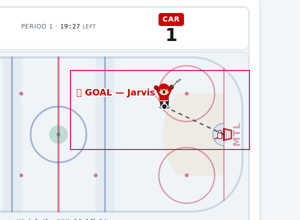 | 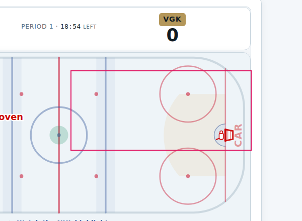 |

<sub>region at x 940, y 320, 360×160px, outlined</sub>

| before | after |
|---|---|
| 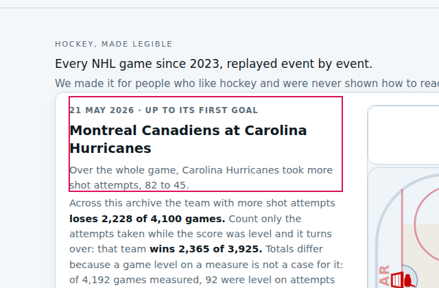 | 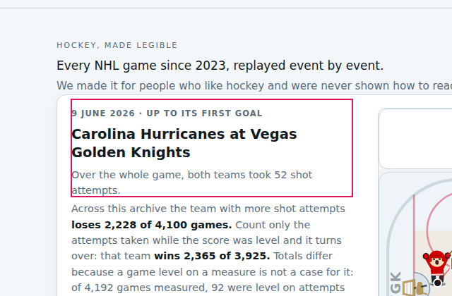 |

<sub>region at x 100, y 180, 400×140px, outlined</sub>

| before | after |
|---|---|
| 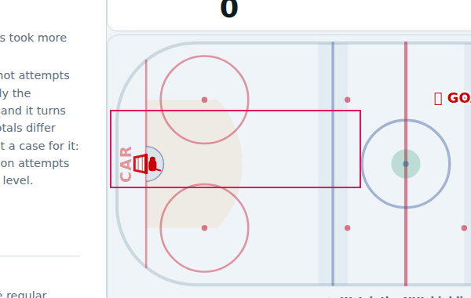 | 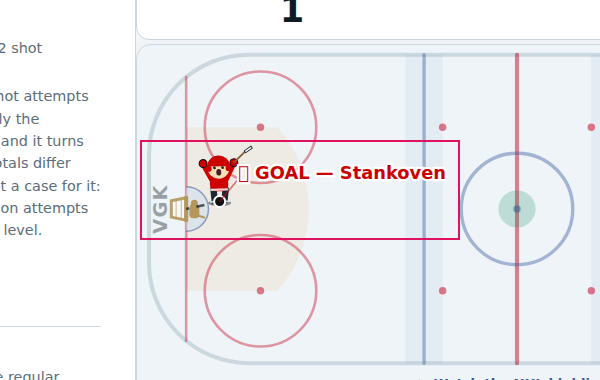 |

<sub>region at x 540, y 380, 320×100px, outlined</sub>

**Pixels, `844×390`** — 324 rows of pixels have no counterpart (10.97% of the page); ⚠️ 17 bands (243 rows) below a height change only moved, redrawn a fraction of a pixel off, and are not shown — a style change inside them would be missed here; their words are in the text diff · page size 844×2954 → 844×2931

| before | after |
|---|---|
| 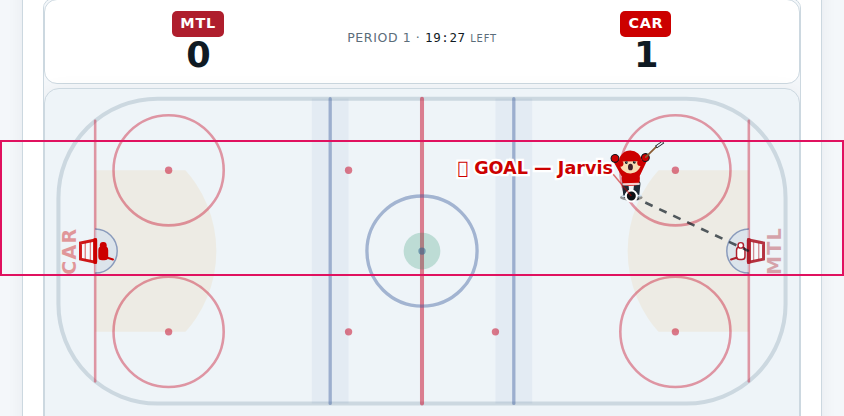 | 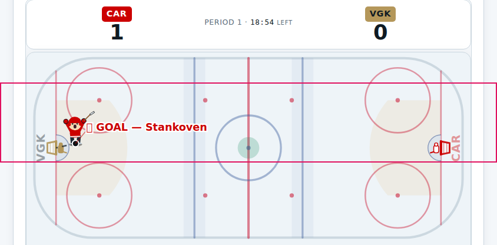 |

<sub>rows 372–508 before, 372–508 after, outlined</sub>

| before | after |
|---|---|
| 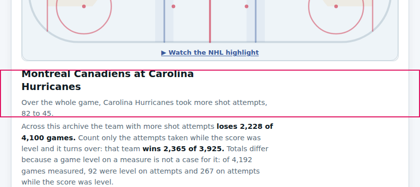 | 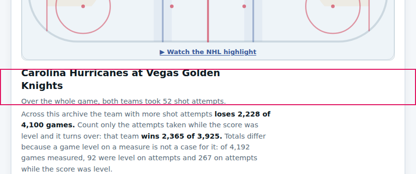 |

<sub>rows 691–787 before, 691–765 after, outlined</sub>

| before | after |
|---|---|
| 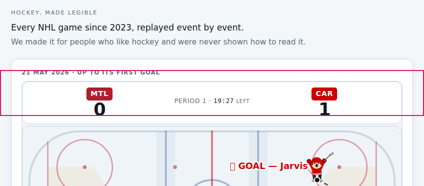 | 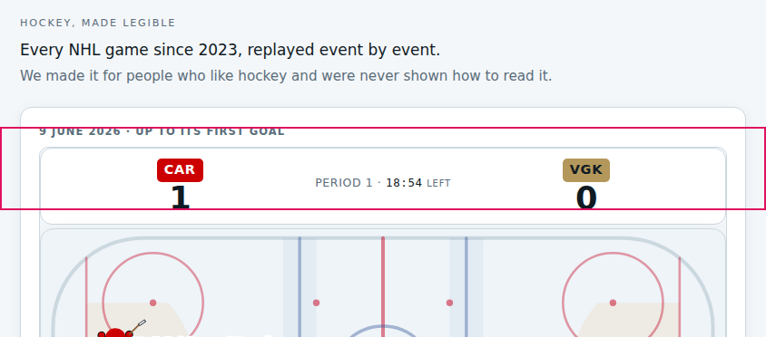 |

<sub>rows 208–300 before, 208–300 after, outlined</sub>

Document: ids removed `[frame /game.html] #ba` `[frame /game.html] #bh` `[frame /game.html] #cA` `[frame /game.html] #cH` `[frame /game.html] #mA` `[frame /game.html] #mH` `[frame /game.html] #pMode` `[frame /game.html] #pName` `[frame /game.html] #pa` `[frame /game.html] #ph`; classes removed `[frame /game.html] .ba` `[frame /game.html] .bar` `[frame /game.html] .bh` `[frame /game.html] .cap2` `[frame /game.html] .cbar` `[frame /game.html] .cc` `[frame /game.html] .corsi` `[frame /game.html] .counters` `[frame /game.html] .lb` `[frame /game.html] .mode` `[frame /game.html] .n` `[frame /game.html] .pct` `[frame /game.html] .plab` `[frame /game.html] .pname`; classes added `[frame /game.html] .empty`

**Is the after side wrong?** → n

Notes → 

## Changed in the document, nothing on screen

Not a question — nothing a reader sees moved. Listed so a removal that was meant to be invisible can be seen to be.

| page | states | ids removed | ids added | classes removed | classes added |
|---|---|---|---|---|---|
| `game.html` | 66 states — 33 at 1400×900, 33 at 844×390 | `#ba` `#bh` `#cA` `#cH` `#mA` `#mH` `#pMode` `#pName` `#pa` `#ph` | — | `.ba` `.bar` `.bh` `.cbar` `.cc` `.counters` `.lb` `.mode` `.n` `.pct` `.plab` `.pname` | — |
| `game.html` | 6 states — 3 at 1400×900, 3 at 844×390 | `#ba` `#bh` `#cA` `#cH` `#mA` `#mH` `#pMode` `#pName` `#pa` `#ph` | — | `.ba` `.bar` `.bh` `.cbar` `.cc` `.counters` `.lb` `.mode` `.pct` `.plab` `.pname` | — |
| `game.html` | `1400×900 game=2023020204&preview=1`, `844×390 game=2023020204&preview=1` | `#ba` `#bh` `#cA` `#cH` `#mA` `#mH` `#pMode` `#pName` `#pa` `#ph` | — | `.ba` `.bar` `.bh` `.cap2` `.cbar` `.cc` `.corsi` `.counters` `.lb` `.mode` `.n` `.pct` `.plab` `.pname` | `.empty` |
| `read-the-game.html` | `1400×900`, `844×390` | `#ba` `#bh` `#cA` `#cH` `#mA` `#mH` `#pMode` `#pName` `#pa` `#ph` | — | `.ba` `.bar` `.bh` `.cbar` `.cc` `.counters` `.lb` `.mode` `.n` `.pct` `.plab` `.pname` | — |

## When you are done

Tell Claude the sheet is judged. Every `y` becomes a defect with its fix; then `docs/reviews/LAST` moves to `b8da207` and the next batch starts there.

## ✅ Judged — Kevin, 2026-09-17

**1 item, 0 wrong** ("I reviewed the sheet and I don't have any changes"). No defect filed. `docs/reviews/LAST` moved to `b8da207`.
